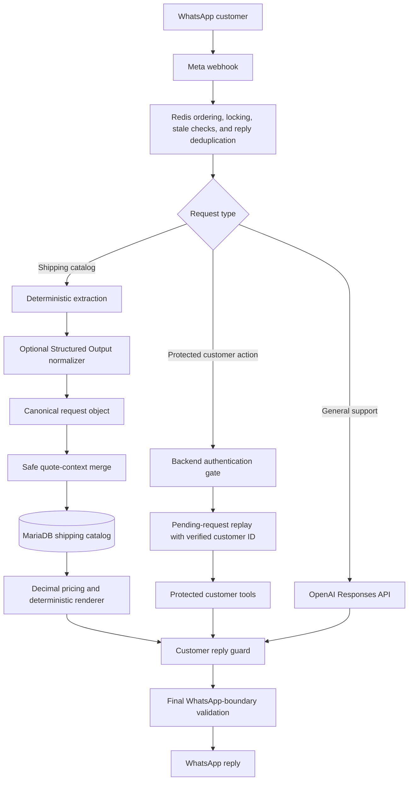

# WhatsApp Shipping & Support Chatbot

A production-oriented Python service for multilingual WhatsApp customer support, authoritative shipping-catalog lookups, protected order assistance, and support-staff administration.

The chatbot accepts English, French, Arabic, Lebanese Arabic, Lebanese Arabizi, Arabizi, and natural mixtures of those styles. Shipping facts and totals come from MariaDB; the AI layer may help normalize customer wording, but it does not receive database credentials, write SQL, choose prices, or perform rate arithmetic.

> **About this README**
> This document describes the latest cumulative build. Historical replacement-bundle and incremental-patch instructions have been intentionally removed so the repository presents one current deployment and operating guide.

## Contents

- [Highlights](#highlights)
- [Architecture](#architecture)
- [Shipping-catalog pipeline](#shipping-catalog-pipeline)
- [Authentication and protected requests](#authentication-and-protected-requests)
- [Customer reply safety](#customer-reply-safety)
- [Staff management](#staff-management)
- [Requirements](#requirements)
- [Configuration](#configuration)
- [Database setup](#database-setup)
- [Validation](#validation)
- [Deployment](#deployment)
- [Acceptance tests](#acceptance-tests)
- [API reference](#api-reference)
- [Operations and troubleshooting](#operations-and-troubleshooting)
- [Key files](#key-files)
- [Security notes](#security-notes)

## Highlights

| Area | Behavior |
| --- | --- |
| Reliable WhatsApp delivery | Per-sender Redis locks, bounded AI turns, stale-message rejection, and at-most-once outbound reply reservation prevent delayed, duplicate, or out-of-order replies. |
| Public shipping assistance | Guests can request prices, transit times, and route categories without authenticating. |
| Canonical catalog lookup | Multilingual customer wording is converted into explicit English lookup fields before live validation against `shipping_db.destinations` and `shipping_db.shipping_rates`. |
| Deterministic pricing | Only explicit `/kg` rates are multiplied, using backend `Decimal` arithmetic and deterministic currency rounding. |
| Safe conversational context | Current-turn values always override prior quote context; omitted quote fields may be reused only from fresh backend state. |
| Style-preserving responses | Replies remain in the customer’s established language and script, including Latin-only Lebanese Arabizi when that style is active. |
| Protected order assistance | The backend pauses a protected request for credentials, verifies them, and resumes the original action instead of stopping at a login confirmation. |
| Output firewall | Intermediate model commentary, internal notes, prompt/tool leakage, invalid script, control characters, empty replies, and oversized replies are blocked before WhatsApp delivery. |
| Staff lifecycle management | Authorized support staff can list, create, edit, deactivate, reactivate, and safely delete agent/admin accounts from `/support`. |

## Architecture



Redis stores conversation state, quote context, processing locks, authentication progress, and outbound deduplication data. MariaDB remains the authority for routes, rate rows, staff accounts, and support-session data.

## Shipping-catalog pipeline

Every request related to the shipping catalog follows one backend-owned path.

```text
Customer message
    -> deterministic extraction
    -> optional semantic normalization
    -> canonical request object
    -> safe context merge
    -> live MariaDB validation
    -> Decimal rate calculation
    -> deterministic style-aware response
```

### Supported request kinds

- `price_quote`
- `route_options`
- `transit_time`

A canonical request can contain:

```json
{
  "request_kind": "price_quote",
  "origin": "USA",
  "destination": "Lebanon",
  "goods_type": "Electronics",
  "shipping_method": null,
  "weight_kg": 25,
  "explicit_origin": true,
  "explicit_destination": false,
  "explicit_goods_type": true
}
```

The normalizer returns only fields explicitly stated in the active customer message. It cannot copy old quote values into explicit fields.

### Trust order

1. Exact deterministic extraction from the current customer turn.
2. Structured semantic normalization for unresolved current-turn fields.
3. Fresh backend quote context for omitted price-quote fields only.
4. Live database rows.

This ordering prevents an older route from being reused when the customer explicitly names a new, unsupported destination. It also prevents a model-normalized value from overriding a locally recognized country, category, method, number, or unit.

### Catalog and arithmetic rules

- The database may keep canonical English labels while customers use supported multilingual variants.
- Composite rows such as `Makeup & Electronics` or `Clothes & Accessories` can match any supported component term or transliteration.
- A shipping method is used as a filter only when the active customer message explicitly requests it.
- `/kg` values are parsed and multiplied in backend code.
- Non-`/kg` rows and special-price text are returned as catalog facts; the application does not invent a total.
- Unsupported explicit destinations remain explicit and produce an authoritative no-match response rather than an old quote.
- Quote state expires after the configured TTL so unrelated future numbers are not captured as stale weights.
- If semantic normalization fails or times out, deterministic matching remains available.

> **Catalog scope:** Route-category results describe rows available in the rate catalog. They are not a complete customs, restricted-goods, dangerous-goods, battery, liquid, or import-policy decision.

## Authentication and protected requests

Shipping rates and route options are public. Customer order and shipment operations are protected.

For a protected request, the backend:

1. Saves the original non-secret customer request.
2. Requests the customer’s user ID using a deterministic template in the active language style.
3. Requests the password without adding it to conversation JSON or sending it to OpenAI.
4. Verifies the credentials in backend code.
5. Replays the exact blocked protected operation with the verified `users.id` injected by the backend.
6. Returns the requested order or shipment result immediately instead of stopping at a login-only acknowledgement.

Example Lebanese Arabizi flow:

```text
Customer: bade tshefle order
Bot:      B3atle l user ID taba3ak.
Customer: 10002
Bot:      Tamem, b3atle l password la nkammel.
Customer: ********
Bot:      [returns the authenticated customer's order/shipment result]
```

When the blocked action is a recent-order lookup, the backend can render the authoritative list directly, including available order IDs, tracking numbers, shipment IDs, and statuses.

## Customer reply safety

The final customer message is treated as a security boundary, not merely as model text.

### Phase-aware extraction

- `phase="final_answer"` output is preferred.
- `phase="commentary"` output is discarded.
- Unphased output remains supported for compatible model/SDK responses.
- A commentary-only response is treated as empty, never as customer-ready text.

### Deterministic reply guard

Before persistence or delivery, the application rejects replies containing:

- known drafting or self-correction phrases;
- prompt, tool, or internal-state leakage markers;
- Arabic-script letters while `leb_arabizi` is active;
- control characters;
- empty or oversized content.

A failed reply receives one isolated, no-tools repair attempt using strict structured output. The repaired text is validated again. If it still fails, the unsafe text is neither stored nor sent; a deterministic style-safe fallback is used. A second validation runs immediately before the WhatsApp send path.

## Staff management

Authenticated `supervisor` and `admin` users can manage staff accounts from `/support`.

Supported actions include:

- list active and inactive accounts;
- create `agent` or `admin` accounts;
- change a name or email/login credential;
- reset a password;
- change `agent` ↔ `admin` role;
- deactivate or reactivate an account;
- safely delete an account by deactivating it and revoking its sessions.

Safety rules include:

- agents cannot access staff-management endpoints;
- write operations require the existing authenticated support session and CSRF token;
- initial passwords must be at least 12 characters and no more than 72 UTF-8 bytes;
- passwords are bcrypt-hashed with cost 12 outside the event loop;
- changing email, password, role, or activation state revokes the target account’s active sessions;
- a user cannot deactivate, delete, or change the role of their own active session account;
- bootstrap `supervisor` accounts cannot be structurally changed through the web screen;
- normalized email identity is trimmed and case-insensitive;
- duplicate normalized emails return HTTP `409` and direct the operator to edit the existing account.

Safe deletion preserves staff IDs referenced by support history and audit data.

## Requirements

The supplied build notes assume the following services already exist:

- a Python application environment and virtual environment;
- MariaDB for application data and the shipping catalog;
- Redis for conversation state, locking, quote context, and idempotency;
- Meta WhatsApp webhook/API credentials;
- an OpenAI API key and configured model;
- `systemd` for the documented production service commands.

The source notes do not declare a minimum Python version or the repository’s dependency installation command. Use the Python version and dependency manifest committed with the project rather than guessing a version here.

Required MariaDB objects include:

```text
shipping_db.destinations
shipping_db.shipping_rates
staff
staff_sessions
```

## Configuration

The following settings are documented by the cumulative build. Defaults are already present in code, but production deployments may set them explicitly in `.env`.

| Variable | Default | Purpose |
| --- | ---: | --- |
| `SHIPPING_DB_SCHEMA` | `shipping_db` | Schema containing destinations and shipping rates. |
| `SHIPPING_SEMANTIC_NORMALIZER_ENABLED` | `true` | Enables optional semantic normalization for unresolved multilingual fields. |
| `SHIPPING_SEMANTIC_NORMALIZER_MODEL` | blank | Uses `OPENAI_MODEL` when blank. |
| `SHIPPING_SEMANTIC_NORMALIZER_TIMEOUT_SECONDS` | `10` | Bounds the semantic normalizer before deterministic fallback. |
| `SHIPPING_CATALOG_CACHE_SECONDS` | `60` | Briefly caches the small destination/rate catalog. |
| `SHIPPING_QUOTE_CONTEXT_TTL_SECONDS` | `1800` | Expires incomplete and recent quote context after 30 minutes. |
| `OPENAI_REQUEST_TIMEOUT_SECONDS` | `45` | Provider request timeout. |
| `OPENAI_MAX_RETRIES` | `1` | Maximum provider retry count. |
| `OPENAI_TURN_TIMEOUT_SECONDS` | `90` | Hard deadline for the complete AI turn. |
| `WHATSAPP_MAX_INBOUND_AGE_SECONDS` | `900` | Rejects uniquely delivered inbound messages older than 15 minutes; `0` accepts any age. |
| `CONVERSATION_PROCESSING_LOCK_TTL_SECONDS` | `180` | Redis lock lifetime for per-sender processing. |
| `OUTBOUND_REPLY_DEDUPE_TTL_SECONDS` | `604800` | Keeps outbound reply reservations for seven days. |

The deployment must also retain its existing OpenAI, Redis, MariaDB, and WhatsApp/Meta credentials. The supplied notes identify `OPENAI_API_KEY`, `OPENAI_MODEL`, and `REDIS_URL`, but do not define every database or Meta credential variable name; preserve the names already used by `app/config.py` and the service environment.

To disable semantic normalization while keeping deterministic aliases, context safety, database matching, arithmetic, and rendering:

```dotenv
SHIPPING_SEMANTIC_NORMALIZER_ENABLED=false
```

## Database setup

### Shipping-catalog permissions

The application’s MariaDB account needs read access to both catalog tables. Use the actual account host returned by MariaDB.

```sql
SELECT User, Host
FROM mysql.user
WHERE User = 'whatsapp_bot';
```

Then grant access to the matching account:

```sql
GRANT SELECT ON shipping_db.destinations
TO 'whatsapp_bot'@'<application-host>';

GRANT SELECT ON shipping_db.shipping_rates
TO 'whatsapp_bot'@'<application-host>';

FLUSH PRIVILEGES;
```

A direct catalog check should use the same host, port, username, and password as the running service. Access through an administrative UI does not prove that the application account has permission.

### Staff email uniqueness

Staff email identity is trimmed and case-insensitive. The database should enforce that rule with a unique index on `staff.email_normalized`.

Before applying the migration, inspect the current table for addresses that collide after trimming and case normalization:

```sql
SELECT LOWER(TRIM(email)) AS normalized_email,
       COUNT(*) AS account_count
FROM staff
GROUP BY LOWER(TRIM(email))
HAVING COUNT(*) > 1;
```

Resolve any conflicts before creating the unique index. Keep the account that should remain active, update any duplicate account to a unique archival email, then deactivate it through `/support` so historical ticket and audit references remain intact.

Apply the repository migration through your normal database migration process:

```text
migrations/20260826_staff_email_uniqueness.sql
```

Example using the MariaDB command-line client:

```bash
mysql -h <db-host> -P <db-port> -u <db-user> -p <app-database> \
  < migrations/20260826_staff_email_uniqueness.sql
```

After applying it, confirm that the exact single-column unique index exists:

```sql
SHOW INDEX FROM staff;
```

The expected invariant is:

```sql
UNIQUE KEY uq_staff_email_normalized (email_normalized)
```

## Validation

Run the repository's normal compilation and automated test suite from the project root:

```bash
source venv/bin/activate
python -m compileall -q app
pytest -q
```

Confirm that the application database account can read the live shipping catalog using the same host, port, username, and password configured for the service:

```bash
mysql -h <db-host> -P <db-port> -u <db-user> -p \
  -e "SELECT origin, destination, shipping_method, goods_type, price, transit_time
      FROM shipping_db.shipping_rates
      LIMIT 5;"
```

Also confirm access to the destination table:

```bash
mysql -h <db-host> -P <db-port> -u <db-user> -p \
  -e "SELECT * FROM shipping_db.destinations LIMIT 5;"
```

For the staff schema, confirm that `uq_staff_email_normalized` is present after the migration:

```sql
SHOW INDEX FROM staff;
```

Compilation and unit tests do not replace the live MariaDB, Redis, OpenAI, Meta webhook, and WhatsApp acceptance tests described below.

## Deployment

The documented VPS layout uses `/root/whatsapp_chatbot_latest`, an existing `venv`, and a `systemd` unit named `shipment-bot`. Adapt these paths and names when your deployment differs.

```bash
cd /root/whatsapp_chatbot_latest

# Preserve the currently deployed application package.
cp -a app "app.backup.$(date +%Y%m%d-%H%M%S)"

# Update this checkout using your normal Git deployment process.

source venv/bin/activate
python -m compileall -q app
pytest -q

# Apply pending SQL migrations through your normal database migration process.
# In particular, apply migrations/20260826_staff_email_uniqueness.sql once
# if the normalized staff-email index is not already installed.

sudo systemctl restart shipment-bot
sudo journalctl -u shipment-bot -n 200 --no-pager
```

After restarting, run the relevant live acceptance tests against a dedicated test customer and test staff account. Do not set `REDIS_URL=''` in production; Redis is required for cross-worker and cross-restart locking, state, and idempotency behavior.

## Acceptance tests

Use a clean test conversation when validating quote context or the two-step authentication flow:

```bash
redis-cli DEL "conversation:<CUSTOMER_WHATSAPP_NUMBER>"
```

Use the customer number in the same format supplied by Meta. Delete only the test conversation key; do not flush the production Redis database.

### Public price quote

Send as a logged-out customer:

```text
shu se3er she7nit cosmetics mn uae aa lebnen bl jaw? 20kg
```

Expected behavior:

- no authentication prompt;
- matching live UAE → Lebanon catalog rows;
- exact backend-calculated totals for explicit `/kg` prices;
- Lebanese Arabizi output with no Arabic-script prose;
- both pickup and delivery totals when the customer did not choose one.

### Public route categories

Send:

```text
طيب شو فيني اشحن من اميركا على لبنان
```

Expected behavior:

- no weight or authentication requirement;
- categories, methods/schedules, listed price text, and transit times from live USA → Lebanon rows;
- no unsupported claim that information is unavailable when rows exist;
- a clear scope note when customs or restricted-goods details require separate confirmation.

### Context-safe multilingual sequence

Send the following in one clean conversation:

```text
eza bade esh7an mawed tejmil mn el emarat 3a lebnen adesh betkallef
25
tyb eza bade esh7an mn el su3udiye 3a lebnen
tamem ysallemon
electronics adesh?
electronics men amerka
ekseswar 3a souriya
50kg ekseswar 3a souriya
tyb 3al iraq fine esh7an?
```

Verify that:

- UAE and KSA totals use their matching `/kg` rows;
- a conversational acknowledgement is not treated as a quote continuation;
- a missing KSA electronics rate returns available categories instead of an invented price;
- `electronics men amerka` selects USA electronics and preserves Lebanese Arabizi;
- `ekseswar` maps to `Clothes & Accessories`;
- `50kg` recalculates the same authoritative row;
- explicit Iraq replaces the old route and returns an authoritative unsupported-destination result;
- the Iraq answer contains no amount or route from the prior quote.

### Authentication resume

Send:

```text
bade tshefle order
```

Complete the user-ID and password flow. The first response after successful authentication must contain the requested order/shipment result. It must not stop at only a login confirmation, and no password may appear in stored conversation data or model input.

### Staff lifecycle

As a supervisor or administrator:

1. Create a test agent.
2. Edit its name and email.
3. Reset its password.
4. Change its role and verify the old session is revoked.
5. Deactivate it and verify login fails.
6. Reactivate it.
7. Delete it and confirm it remains inactive with sessions revoked.
8. Attempt to create another account using the same email with different casing or whitespace; expect HTTP `409` and an edit-existing-account path.
9. Sign in as an agent and verify the UI control is hidden and direct staff API calls return HTTP `403`.

## API reference

Staff management is exposed under the existing support application.

| Method | Endpoint | Purpose | Authorization |
| --- | --- | --- | --- |
| `GET` | `/api/support/staff` | List active and inactive staff accounts using a safe public projection. | `supervisor` or `admin` |
| `POST` | `/api/support/staff` | Create an `agent` or `admin`. | `supervisor` or `admin`, authenticated session, CSRF |
| `PATCH` | `/api/support/staff/{staff_id}` | Update identity, credentials, role, or activation state. | `supervisor` or `admin`, authenticated session, CSRF |
| `DELETE` | `/api/support/staff/{staff_id}` | Safely deactivate the account and revoke sessions. | `supervisor` or `admin`, authenticated session, CSRF |

Example create body:

```json
{
  "name": "Agent Name",
  "email": "agent@example.com",
  "password": "minimum-12-characters",
  "role": "agent"
}
```

`role` is restricted to `agent` or `admin`. Creating another bootstrap `supervisor` through the web interface is intentionally unsupported.

Shipping-price and route-option operations are customer-facing chatbot capabilities rather than documented public HTTP endpoints in the supplied materials.

## Operations and troubleshooting

### Useful log messages

| Log text | Meaning |
| --- | --- |
| `Shipping catalogue request normalized: kind=price_quote ...` | A canonical price request reached the shipping pipeline. |
| `Shipping catalogue request normalized: kind=route_options ...` | A route-category request reached the shipping pipeline. |
| `Shipping semantic normalizer unavailable: error_type=...` | Semantic normalization failed or timed out; deterministic parsing remains available. |
| `Outbound reply suppressed by idempotency guard` | A duplicate outbound reply was blocked. |
| `Stale/out-of-order inbound WhatsApp message ignored` | An old or out-of-order inbound message was acknowledged without processing. |
| `Conversation is already processing another message` | Per-sender serialization prevented concurrent processing. |
| `AI turn timed out` | The complete AI turn exceeded its deadline. |
| `Authentication gate activated: ... pending_request=True ...` | A protected request was preserved while credentials were requested. |
| `AI tool dispatch: tool=get_customer_shipments authenticated=True` | A protected shipment action ran after authentication. |
| `Pending request resume produced no protected tool call; retrying` | A login-only response was rejected and the original request was retried. |
| `AI customer reply rejected by output guard` | Unsafe or malformed model output was blocked. |
| `AI customer reply repaired by output guard` | The isolated formatter produced a valid replacement. |
| `Unsafe AI reply blocked at WhatsApp boundary` | The final send-boundary check prevented delivery. |

### Common checks

**A route exists in phpMyAdmin but the bot cannot find it**

Test with the exact MariaDB account and connection settings used by the service, then verify `SELECT` grants on both shipping catalog tables.

**A quote appears to reuse old context**

Delete only the affected test conversation’s Redis key and repeat the full sequence. Confirm that explicit current-turn fields are present in normalization logs.

**Staff creation reports a duplicate email**

Edit the existing account rather than creating another role-specific duplicate. For legacy conflicts, inspect the normalized email values, resolve the duplicate records, apply `migrations/20260826_staff_email_uniqueness.sql`, and confirm that `uq_staff_email_normalized` exists.

**Semantic normalization is unavailable**

Check the OpenAI configuration and timeout. The deterministic matcher should continue to handle recognized aliases, digits, units, context safety, database validation, arithmetic, and rendering.

**Rapid customer messages produce a busy response**

This can be expected while the sender lock is active. Meta may retry the webhook; final replies must remain ordered and deduplicated by inbound message ID.

## Key files

| Path | Responsibility |
| --- | --- |
| `app/main.py` | Webhook orchestration, authentication flow, send-boundary checks, and application entry behavior. |
| `app/config.py` | Service and shipping-pipeline configuration. |
| `app/ai_config.py` | Model instructions and tool behavior. |
| `app/openai_service.py` | Responses API calls, phase-aware extraction, tool flow, and guarded reply handling. |
| `app/conversation_store.py` | Redis-backed conversation, quote, authentication, and processing state. |
| `app/language.py` | Language/style detection and Lebanese Arabizi handling. |
| `app/shipping_intent_normalizer.py` | Narrow Structured Output normalization of explicit shipping fields. |
| `app/shipping_quote_service.py` | Canonical request handling, context merge, pricing, and deterministic rendering. |
| `app/shipment_client.py` | Live shipping-catalog and customer shipment access. |
| `app/customer_reply_guard.py` | Deterministic validation of customer-visible replies. |
| `app/whatsapp_client.py` | WhatsApp delivery and outbound idempotency behavior. |
| `app/staff_management.py` | Staff-account lifecycle rules. |
| `app/staff_repository.py` | Staff persistence and normalized email checks. |
| `app/support_api.py` | Support and staff-management API routes. |
| `app/support_ui.py` | `/support` dashboard behavior. |
| `tests/test_canonical_shipping_pipeline.py` | Canonical shipping-pipeline coverage. |
| `migrations/20260826_staff_email_uniqueness.sql` | Staff email normalization and unique-index migration. |

## Security notes

- Database credentials are not provided to the model.
- The model does not write SQL, select rates, or calculate shipping totals.
- Passwords stay outside conversation JSON and are never sent to OpenAI.
- Protected tools receive the verified customer ID from backend code, not from model-provided identity.
- Redis locks and outbound reservations enforce ordering and at-most-once primary replies across workers and restarts.
- Customer output is validated before persistence and again before WhatsApp delivery.
- Rejected reply bodies are not written to application logs; reply-guard logs contain reason labels and hashed customer identifiers.
- Canonical shipping logs record operation type and field-presence information rather than raw customer messages or provider response bodies.
- Staff passwords and hashes are not returned by the API or written to logs.
- Credential, role, and activation changes revoke active sessions.
- Safe staff deletion preserves historical references by deactivating the account instead of hard-deleting its row.
